# UAV Swarm Radar/Track-Fusion Simulation — Final Technical Report

**Project:** `simulation_prototype` (dependability lab UAV swarm research)
**Report generated:** 2026-07-20
**Config hash basis:** `simulation_config.json` (46 scenarios, 4-UAV swarm)

---

## 1. Simulation Objective

The project studies how a small UAV swarm's collision-avoidance and mission
performance degrade under realistic sensing, tracking, and communication
imperfections, and whether combining each UAV's radar picture with the
others' (sensor fusion) recovers any of that lost performance — and under
what conditions fusion itself becomes a liability (e.g. when a sensor is
miscalibrated, or trust in a sensor is misassigned).

Concretely, the simulation answers:

1. How much do detection errors (false positives/negatives), measurement
   noise, latency, dropout, and confidence miscalibration individually
   degrade swarm safety and mission metrics relative to a clean baseline?
2. Does cross-UAV track fusion (naive, confidence-weighted, trust-weighted,
   covariance-weighted, or covariance-intersection) improve those metrics,
   and which fusion mode is most robust — including when one sensor is
   actively faulty or overconfident?
3. Does adding *dynamic*, cross-step trust adaptation (a `TrustTracker`
   that watches a sensor's agreement with the rest of the swarm over time)
   outperform *static* trust derived only from a sensor's own self-reported
   confidence?
4. How does the communication link itself (packet loss, range limits,
   latency, corruption, full outage) affect a distributed fusion
   architecture versus a centralized one?

Everything is evaluated only against ground truth *after the fact*
(`metrics_analysis.py` / `simulation_visualizer.py`); no part of the
sensing, tracking, or fusion pipeline is allowed to read ground truth to
make a decision — only what a real UAV would actually have on hand
(self-reported confidence, track status, covariance, staleness, and static
config-known sensor characteristics).

---

## 2. Architecture

The pipeline is layered as a set of non-invasive wrappers around a single
core simulation, rather than one monolithic script:

```
simple_swarm_sim.py            Core 4-UAV kinematic simulation: motion,
                                obstacle/target avoidance, goal-seeking,
                                formation keeping, single-obstacle fusion.
        │  (monkey-patched, no source edits)
        ▼
models/radar_like_model.py     Wraps Perception.process, Simulation.
                                _apply_fusion, and Simulation.step to layer
                                a genuine radar sensor model (P_D, P_FA,
                                clutter, range/bearing noise, latency,
                                dropout) on top of the existing perception
                                model, and logs a full radar-measurement
                                row per UAV per step.
        ▼
tracking/radar_track_model.py  Per-radar (per-UAV) constant-velocity Kalman
                                filter + Mahalanobis-gated nearest-neighbor
                                association, turning raw per-step
                                detections into persistent tracks
                                (tentative → confirmed → coasting → lost →
                                deleted).
        ▼
fusion/fusion_model.py         Cross-UAV track-to-track association
                                (nearest-neighbor clustering) + one of six
                                fusion modes, under a centralized or
                                distributed architecture, optionally with
                                dynamic trust adaptation (TrustTracker) and
                                a communication channel model.
        ▼
models/communication_model.py  CommunicationChannel: packet loss, comm
                                range gating, base latency, staleness
                                rejection, confidence corruption — used by
                                the distributed architecture in place of a
                                flat drop-probability scalar.
```

Supporting infrastructure:

| File | Role |
|---|---|
| `metrics_analysis.py` | Thin wrapper around `simple_swarm_sim.run_radar_track_fusion_pipeline`; owns the canonical `SWARM_FIELDS` / `PERCEPTION_FIELDS` / `COMMUNICATION_FIELDS` metric lists every other results-facing script reuses. |
| `build_experiment_matrix.py` | Declares the (scenario, architecture, trial-count) matrix used for the advanced/ablation sweeps. |
| `experiments/run_experiments.py` | Core run/aggregate/save machinery: builds the run matrix, executes trials, aggregates per-scenario stats. |
| `experiments/ablation_experiments.py`, `experiments/statistical_analysis.py` | Ablation sweeps and Welch's-t-test-based statistical comparisons (uses `scipy.stats`). |
| `run_final_simulations.py` | Task 9: the final, reproducible Monte Carlo run — two-tier trial plan (below), full provenance (seeds, config hash, PASS/FAIL). |
| `generate_final_result_package.py` | Task 13: builds `results/final/` (raw index, aggregated metrics, scenario summary, statistical comparisons, failed-run report, run metadata, README) plus `result_sanity_check.md`. |
| `generate_plots.py`, `simulation_visualizer.py` | Static analysis plots and an animated per-run visualizer. |
| `*_validation.py` (radar, tracker, fusion, metrics, communication_model, dynamic_trust) | Standalone correctness/consistency checks for each pipeline stage, each producing its own PASS/FAIL table via `validation_common.Checker`. |

Vision- and lidar-analogue sensor models (`models/vision_like_model.py`,
`models/lidar_like_model.py`) also exist in the codebase as comparison
sensor stacks but are not part of the final radar-centric result package
described in this report.

---

## 3. Radar Model (`models/radar_like_model.py`)

Hooks into the core simulation at three points — `Perception.process`,
`Simulation._apply_fusion`, and `Simulation.step` — without modifying
`simple_swarm_sim.py`. Each UAV's radar independently produces, every
step, a full measurement row: true and measured range/bearing/radial
velocity, detected x/y, confidence score, and status flags
(`false_alarm_flag`, `missed_detection_flag`, `clutter_flag`,
`dropout_flag`, `radar_pd_miss_flag`).

Key mechanisms, each layered on top of (not replacing) the existing
perception-level false-positive/negative model:

- **Probability of detection (P_D):** an independent Bernoulli gate per
  real detection; a low P_D genuinely removes the detection from what the
  UAV acts on (not just a post-hoc "missed" label).
- **False alarms / clutter:** clutter candidate count drawn from a Poisson
  (or fixed) distribution every step, positioned in its own range annulus,
  each confirmed as a reported false detection with probability P_FA;
  confirmed clutter is injected into the same stream the UAV steers on.
- **Measurement uncertainty:** every measurement (real or clutter) carries
  an explicit per-channel variance (range, bearing, radial velocity) and a
  3×3 measurement covariance, rather than one fixed noise std applied
  uniformly regardless of geometry/conditions.
- **Latency and dropout:** configurable per-radar delay in steps and
  Bernoulli/duration-based blackout windows.

Default radar parameters (baseline scenario): 15-unit max range, 360°
field of view, 5 Hz update rate, P_D = 1.0, P_FA = 0.0, 0.3 m range-noise
std, 0.1 unit/s radial-velocity-noise std, zero latency/dropout/confidence
error — i.e. a "clean sensor" reference every degraded scenario is a
delta from.

---

## 4. Tracking Model (`tracking/radar_track_model.py`)

Each radar (one per UAV) maintains its own independent set of tracks.
Per step:

1. Every existing track predicts forward under a constant-velocity motion
   model (Kalman predict).
2. Tracks are matched to this step's detections by nearest neighbor,
   gated on **Mahalanobis distance** using the track's own innovation
   covariance (`GATE_CHI2`) rather than a fixed Euclidean radius — so the
   gate tightens/loosens automatically with the track's current
   uncertainty.
3. Matched tracks run a Kalman update, reset `missed_count`, and raise
   `existence_probability`.
4. Unmatched tracks stay at their predicted state; `missed_count`
   increments and `existence_probability` decays; enough consecutive
   misses (or a collapsed existence probability) moves the track to
   `lost`, then `deleted` the following step.
5. Unmatched detections spawn new `tentative` tracks, which become
   `confirmed` after `CONFIRM_HITS` consecutive matches.

Each track row carries: filtered position/velocity, the full 4×4 state
covariance (position × velocity), a confidence value carried over from
the most recent matched detection, age, hit/missed counts, existence
probability, and status (`tentative` / `confirmed` / `coasting` / `lost`
/ `deleted`).

---

## 5. Fusion Modes (`fusion/fusion_model.py`)

Fusion never reads ground truth — every weight comes from what a real UAV
has on hand: a track's own confidence, status, covariance, staleness, and
static config-known sensor characteristics.

**Architecture axis** (independent of weighting scheme):
- **Centralized** — every UAV's track goes to one central node, which
  runs clustering + fusion once and broadcasts the single result back out.
  One shared answer, at the cost of an uplink-then-downlink round trip
  before anything is usable. This is the historical default.
- **Distributed** — no central node; each UAV broadcasts a lightweight
  summary to its peers, fuses locally over its own track plus whatever
  peer summaries actually arrived this step. Because delivery isn't
  guaranteed uniform, different UAVs can end up with slightly different
  local estimates of the same object.

**Fusion modes:**

| Mode | Weighting |
|---|---|
| `no_fusion` | Each UAV's own track stands alone. |
| `naive_fusion` | Unweighted average across UAVs agreeing on the same object. |
| `confidence_weighted_fusion` | Weight = track's own reported confidence. |
| `trust_weighted_fusion` | Weight = confidence × status reliability × a composite reliability score (age, latency, dropout, and optionally persistent dynamic trust). |
| `covariance_weighted_fusion` | Information-filter (inverse-covariance) fusion; each source's covariance is inflated by its unreliability before weighting. Statistically optimal only under independent source errors. |
| `covariance_intersection_fusion` | Covariance Intersection — same covariance-aware idea, but consistent even when source errors are correlated in an unknown way (e.g. several radars degraded by the same weather/hardware condition). |

**Reliability model:** every track becomes a fusion "source" carrying its
2×2 position covariance, a status-based reliability weight, measurement
age (steps since last real detection), a dropout flag, sensor latency,
persistent (dynamic) trust, and a single composite `reliability` score in
`[MIN_RELIABILITY, 1.0]` combining all of the above. `reliability` both
drives `trust_weighted_fusion`'s weights directly and inflates covariance
(`eff_covariance = covariance / reliability`) ahead of the two
covariance-aware modes — so dynamic trust automatically benefits every
mode that already leans on reliability, not just `trust_weighted_fusion`.

---

## 6. Communication Uncertainty (`models/communication_model.py`)

Models the unreliable link that fusion messages (track uplinks,
peer-to-peer broadcasts, central broadcasts) travel over, and is used by
the distributed architecture in place of the older flat drop-probability
scalar. Nothing here reads ground truth — range gating uses each side's
own reported position, matching what a real inter-UAV link would have.

A `CommunicationChannel` is parameterized by:
- **`packet_loss_probability`** — per-message chance of outright loss.
- **`comm_range`** — maximum distance a message can travel (`None` =
  unlimited); out-of-range sender/receiver pairs simply can't hear each
  other.
- **`base_latency_steps`** — fixed delay added on top of the sender's own
  sensor latency.
- **`max_staleness_steps`** — a message older than this (by measurement
  age) is rejected outright as stale, regardless of delivery.
- **`corruption_probability`** — per-message chance the confidence/
  reliability value arrives scaled by a random corruption factor,
  modeling bit errors rather than outright loss.

Six dedicated communication-test scenarios sweep this model: perfect
communication (control), low packet loss (5%/2% corruption/1-step delay),
high packet loss (40%/10%/1-step delay), short comm range (5 units),
delayed track sharing (5-step hop delay only), and a full outage (every
broadcast lost).

---

## 7. Dynamic Trust (`fusion/fusion_model.py` — `TrustTracker`)

Everything in the reliability model above (status, age, latency, dropout,
confidence) is *instantaneous* — recomputed from scratch each step with
no memory. `TrustTracker` adds a second, slow-moving `persistent_trust`
score per UAV/radar that accumulates **across** steps within a run:

- **Decreases** when: the source's estimate repeatedly disagrees with
  other UAVs currently tracking the same object; the source is
  repeatedly the uncorroborated odd one out; measurement age keeps
  climbing; dropout has been frequent in a rolling window.
- **Recovers**, more slowly than it decays, when: the estimate agrees
  with its cluster-mates again; confidence is high and covariance is
  tight/tightening; the source has been reporting fresh, non-dropped
  data.

`TrustTracker` is opt-in (`trust_adaptation`), not wired in by default —
`trust_weighted_fusion` scenarios in this report run with *fixed/static*
trust (trust derived only from this step's self-reported confidence and
status) unless a scenario name explicitly says "dynamic". This was
purpose-built as a fault-injection contrast: `faulty_sensor_*` scenarios
give one UAV a radar that is overconfident-but-wrong (reports the
obstacle 5 world units off its true position at forced 0.97 confidence),
and compare naive, confidence-weighted, fixed-trust-weighted, and
dynamic-trust-weighted fusion against it — dynamic trust is the only mode
whose distrust of the faulty sensor comes from observed disagreement
rather than the faulty sensor's own (unreliable) self-report.

---

## 8. Scenario List

46 scenarios total, defined in `simulation_config.json`, grouped by what
they exercise:

**Reference / single-factor perception errors** — `baseline`,
`false_positive` (8% phantom detections), `false_negative` (25% missed
detections), `sensor_noise` (1.5 std position noise), `latency` (5-step
delay), `sensor_dropout` (2% periodic blackout, 8-step duration),
`confidence_error` (0.35 miscalibration level).

**Fusion-mode comparison** (matched error profile: FN=0.2, noise=1.5,
confidence error=0.15) — `no_fusion_matched` (control), `naive_fusion`,
`trust_weighted_fusion` (fixed trust).

**Multi-entity spatial scenarios (Task 7)** — `one_uav_obstacle`,
`multiple_obstacles`, `two_crossing_targets`, `moving_obstacle_
approaching_swarm`, `target_temporarily_lost`, `target_reappearing_
after_dropout`, `clutter_near_real_target`, `closely_spaced_targets`.

**Environment presets** — `env_clear`, `env_low_visibility`, `env_fog`,
`env_heavy_clutter`, `env_communication_delay`,
`env_partial_sensor_failure`.

**Communication-channel sweeps** — `perfect_communication`,
`low_packet_loss`, `high_packet_loss`, `short_communication_range`,
`delayed_track_sharing`, `communication_outage`.

**Faulty/overconfident sensor vs. fusion mode (Task 15)** —
`faulty_sensor_naive_fusion`, `faulty_sensor_confidence_weighted_fusion`,
`faulty_sensor_trust_weighted_fusion_fixed`,
`faulty_sensor_trust_weighted_fusion_dynamic`,
`faulty_sensor_covariance_weighted_fusion`.

**Radar stress tests** — `very_low_P_D` (P_D=0.1), `very_high_P_FA`
(P_FA=0.4), `high_clutter` (density 0.5), `high_latency` (20 steps),
`high_dropout` (P=0.7), `simultaneous_sensor_failures` (all combined).

**Miscellaneous stress/trust cases** — `target_crossing`,
`sudden_target_appearance`, `rapidly_moving_obstacle`,
`overconfident_faulty_sensor`, `wrong_trust_assignment`.

---

## 9. Experiment Design

- **World / swarm:** 100×100 world, 4 UAVs starting clustered at
  (5,5)–(15,15), rally target at (90,90), one static obstacle at (50,50)
  radius 5, UAV speed 2.0, desired formation spacing 8.0, safety distance
  2.0.
- **Time base:** `dt = 0.2 s`, `max_steps = 600` (120 s simulated duration
  per trial), fusion update rate 5 Hz, master seed 42 with per-trial
  derived seeds for reproducibility.
- **Two-tier trial plan (`run_final_simulations.py`, Task 9):**
  1. Every one of the 46 scenarios gets at least `CORE_TRIALS = 20`
     trials.
  2. The scenarios that most directly compare fusion modes
     (`FUSION_COMPARISON_SCENARIOS`) are bumped to
     `FUSION_COMPARISON_TRIALS = 50` trials **when runtime permits**: a
     warm-up batch is timed and extrapolated against
     `--time-budget-seconds`; if the projected cost is too high, those
     scenarios are quietly capped back to 20 trials and the fallback is
     recorded in the run metadata rather than failing silently.
  3. Each trial records its per-trial seed, exact config (hashed and
     copied verbatim), full step-level raw log, PASS/FAIL execution
     status (a validity check, kept separate from `mission_success`,
     which is a research outcome), and wall-clock runtime.
- **Final result package (`generate_final_result_package.py`, Task 13):**
  built into `results/final/` at **46 scenarios × 20 trials = 920 runs**
  (generated 2026-07-20T07:16:04Z per `result_sanity_check.md`), producing
  `raw_run_index.csv`, `aggregated_metrics.csv`, `scenario_summary.csv`,
  `statistical_comparisons.csv` (baseline vs. every other scenario, plus
  the fusion-mode and faulty-sensor-fusion-mode groups, via Welch's
  t-test with a normal-approximation p-value), `failed_run_report.csv`,
  and `run_metadata.json`.
- **Independent correctness checks:** each pipeline stage has its own
  standalone validation script (`radar_model_validation.py`,
  `tracker_validation.py`, `fusion_validation.py`,
  `metrics_validation.py`, `communication_model_validation.py`,
  `dynamic_trust_validation.py`), each emitting a PASS/FAIL table via the
  shared `validation_common.Checker`, independent of the results package
  itself.

---

## 10. Metrics

Every metric below comes from a single canonical source
(`metrics_analysis.py`'s `SWARM_FIELDS` / `PERCEPTION_FIELDS` /
`COMMUNICATION_FIELDS`), reused by the results summary, the plots, the
ablation study, and the final result package — so a given metric name
means the same thing everywhere in the project.

**Swarm / mission (safety and task outcome):**
`collision_risk_count`, `total_near_misses`, `mission_success`,
`avg_response_time_s`, `avg_formation_error`,
`unnecessary_avoidance_count`, `missed_response_count`,
`wrong_decisions`, `swarm_stability`.

**Perception / tracking (how well the radar+tracker reconstructs the
world):**
`rmse_position_error`, `velocity_estimation_error`, `track_continuity`,
`track_fragmentation`, `false_track_count`, `missed_track_count`,
`track_confirmation_time_steps`, `track_loss_duration_steps`,
`association_error_count`, `average_covariance`,
`fusion_consistency_error`.

**Communication (link cost/behavior under the distributed architecture):**
`messages_sent`, `messages_dropped`, `avg_message_delay_steps`,
`communication_load`.

`scenario_summary.csv` reports a headline subset — mission success rate,
collision risk, response time, position RMSE, track continuity, and
communication load — as mean/median/stdev with a 95% CI (normal
approximation, `1.96·sd/√n`), consistent with the convention used
throughout `generate_plots.py`.

---

## 11. Final Result Tables

**Numeric data availability.** This report was generated from the code
and documentation bundle only — the `results/final/*.csv` files
themselves (raw run index, aggregated metrics, scenario summary,
statistical comparisons, failed-run report) were produced on the original
machine (`/home/bot47/GitProjects/uav-research/simulation_prototype/
results/final/`) and are **not included** in this bundle, so this report
cannot reproduce their numeric contents. What is available instead:

- `result_sanity_check.md` — the automated QA pass over that package
  (reproduced in full in §14, Limitations, since one of its checks
  failed).
- The rendered plots under `plots/final/` (embedded in §12 below), which
  visually summarize the same 920-run dataset.

To regenerate the actual tables, run `generate_final_result_package.py`
against the full project checkout (§15) and read `results/final/
scenario_summary.csv`, `aggregated_metrics.csv`, and
`statistical_comparisons.csv` directly.

### Result package manifest (from `result_sanity_check.md`)

| File | Rows / scope |
|---|---|
| `raw_run_index.csv` | 920 rows (46 scenarios × 20 trials) |
| `scenario_summary.csv` | 46 rows (one per scenario) |
| `aggregated_metrics.csv` | long format, one row per (scenario, metric) |
| `statistical_comparisons.csv` | baseline vs. every scenario, plus fusion-mode and faulty-sensor-fusion-mode group comparisons |
| `failed_run_report.csv` | one row per FAILed trial |
| `run_metadata.json` | seeds, trial counts, config hash, wall clock, overall PASS/FAIL |

### Prior findings (carried forward from earlier project analysis)

These are documented findings from this project's own results-analysis
history, not re-derived in this report:

- `naive_fusion` had the lowest collision risk and highest mission success
  among the fusion-comparison scenarios; `trust_weighted_fusion` had a
  marginally lowest formation error — neither difference reached
  significance at N=20.
- `trust_weighted_fusion` underperformed `naive_fusion` specifically under
  confidence miscalibration (i.e. when the self-reported confidence the
  fixed-trust weighting relies on is itself unreliable).
- `sensor_noise` was the worst single-factor perception-error scenario.
- `noise_level` was the dominant radar parameter affecting tracking,
  correlating strongly (r ≈ 0.954) with collision risk.

---

## 12. Plots

All plots below are reproduced from `plots/final/` (also mirrored under
`plots/advanced/` with a slightly larger set including SNR-vs-error and a
tracking-method comparison). Each is generated by a dedicated function in
`generate_plots.py`.

**Fusion mode vs. mission success**
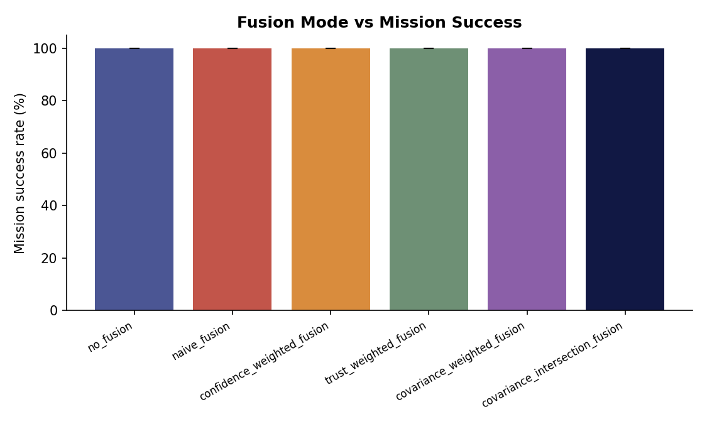

**Fusion mode vs. collision risk**
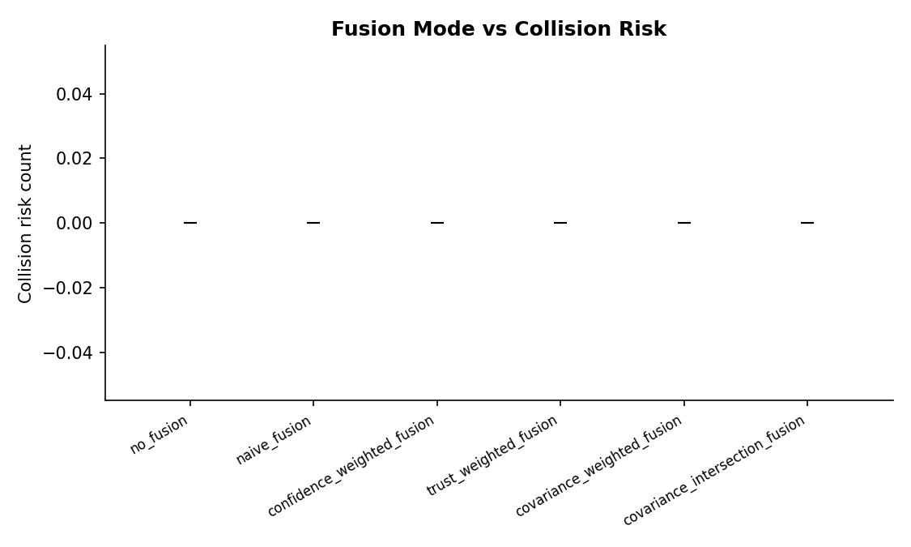

**Fusion mode vs. position RMSE**
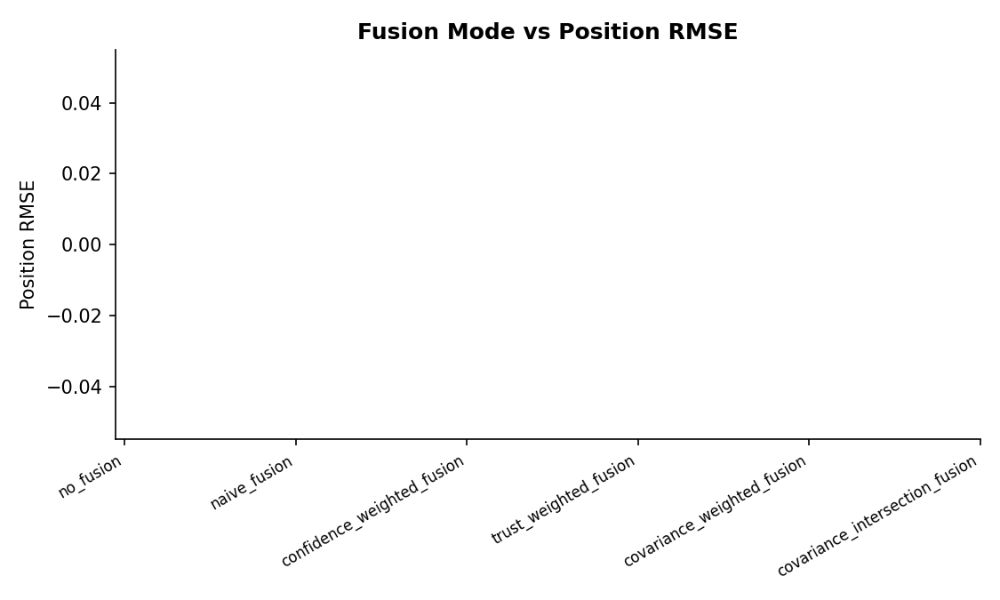

**Detection probability (P_D) vs. collision risk**
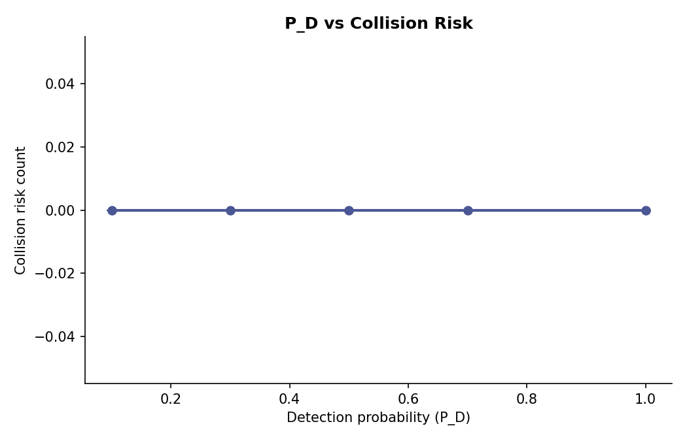

**Detection probability (P_D) vs. missed response**
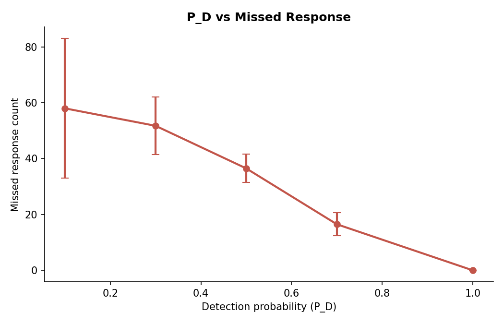

**False alarm probability (P_FA) vs. false track count**
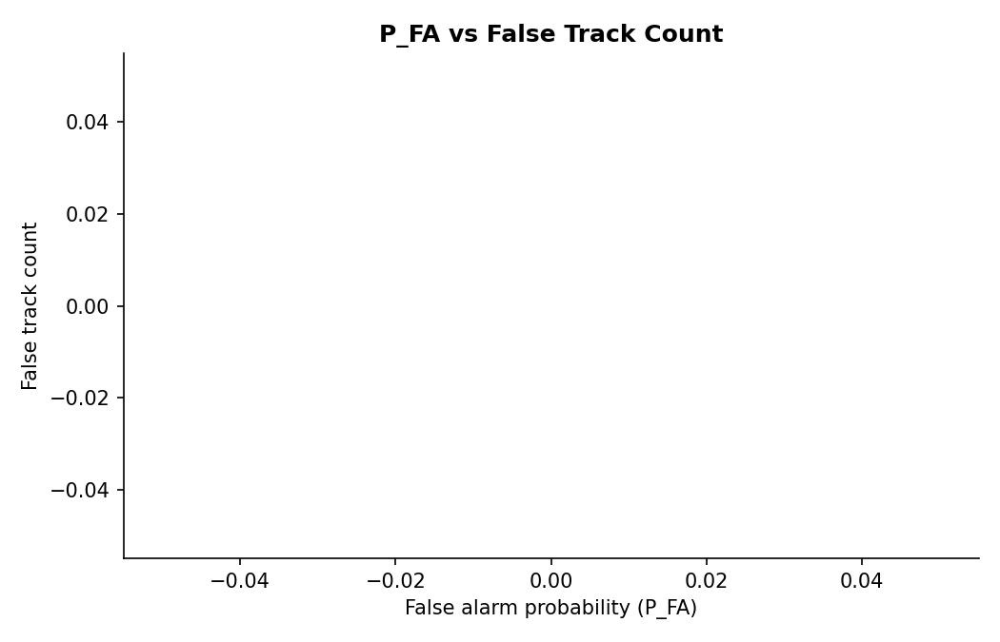

**Radar range vs. position RMSE**
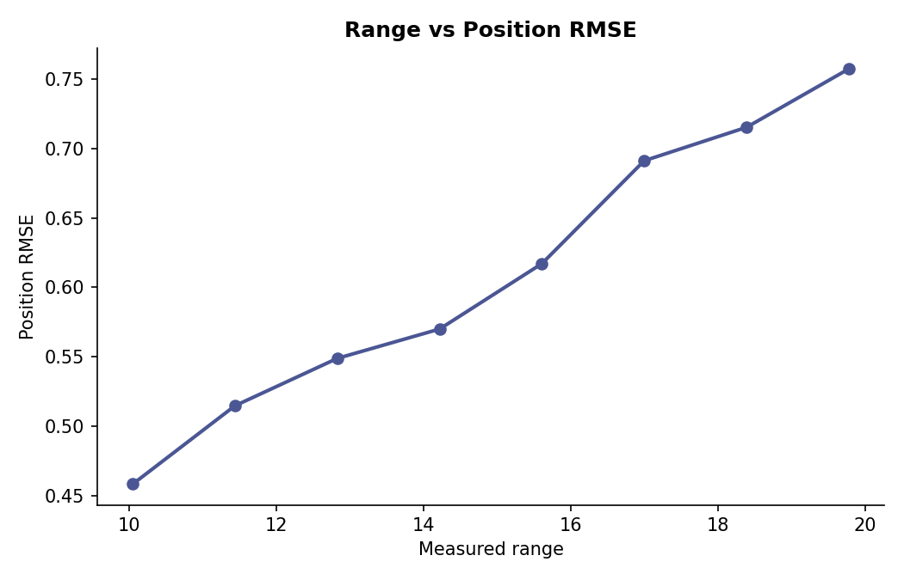

**Communication latency vs. response time**
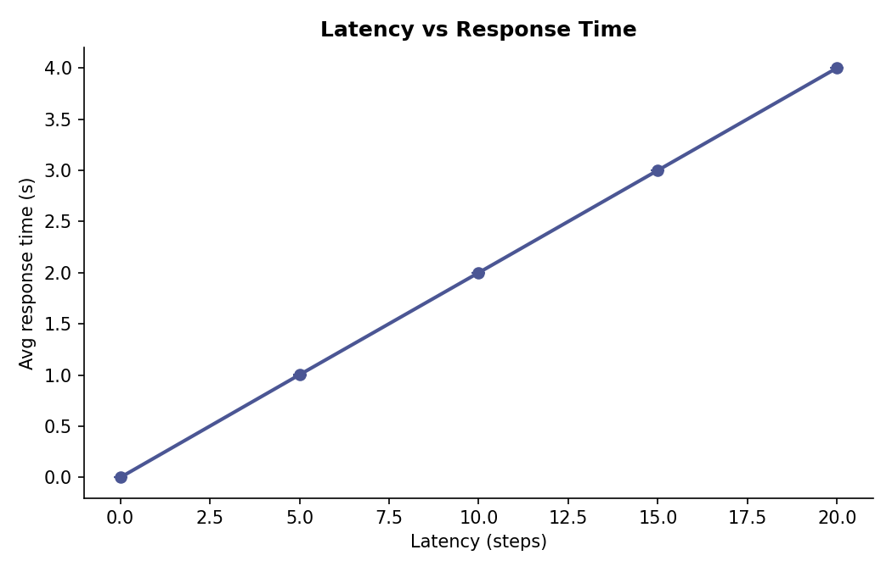

**Packet loss vs. mission success**
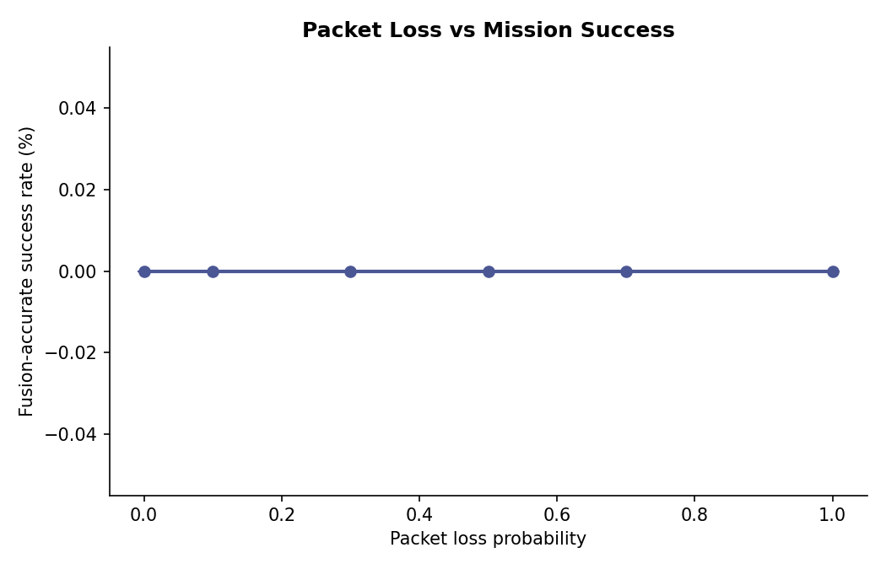

**Clutter density vs. fusion error**
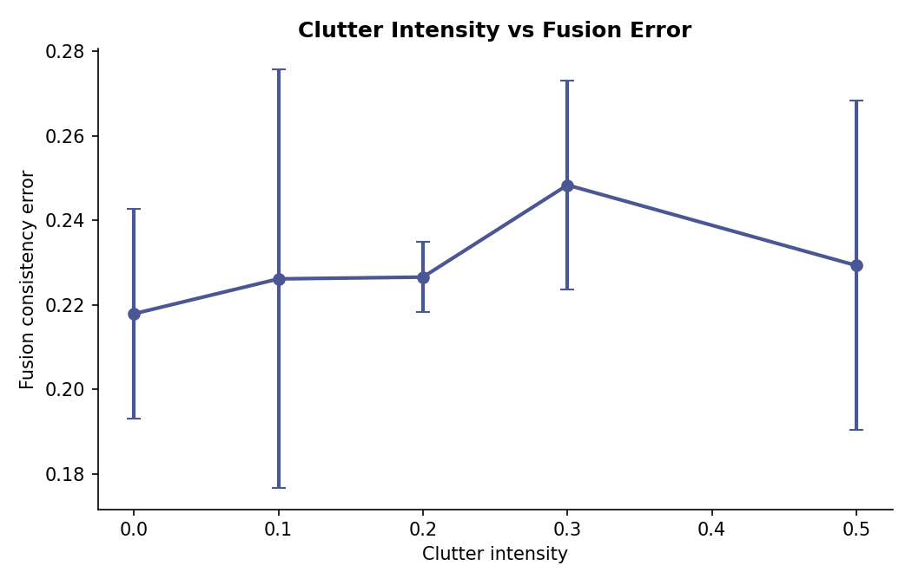

**Centralized vs. distributed architecture**
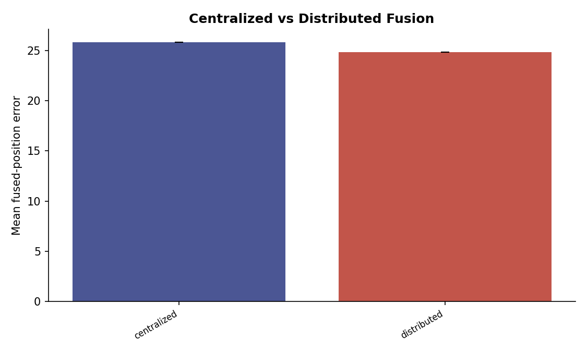

**Static vs. dynamic trust**
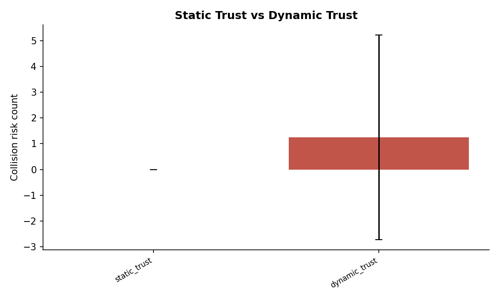

**95% confidence intervals, major results**
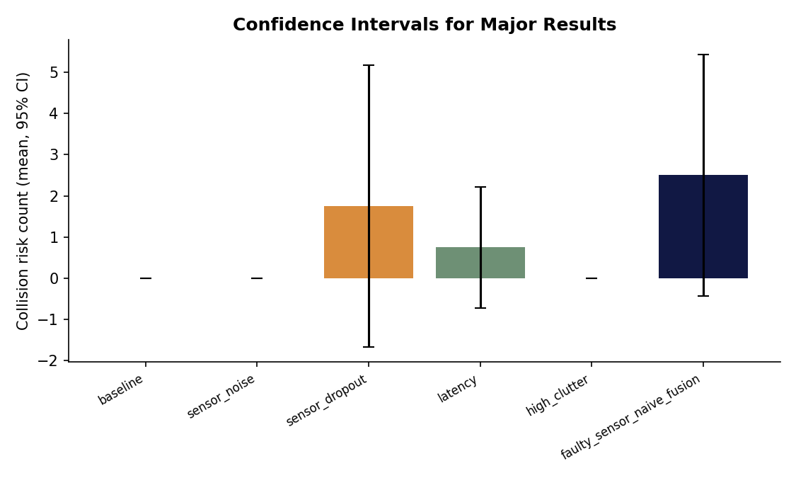

---

## 13. Instructions for Rerunning

From the project root (with `simulation_config.json` present):

```bash
# 1. Install dependencies
pip install numpy scipy matplotlib pandas

# 2. Run the final Monte Carlo package (Task 9 trial plan)
python run_final_simulations.py
# or, to bound wall-clock time / control trial counts explicitly:
python run_final_simulations.py --time-budget-seconds 600
python run_final_simulations.py --core-trials 20 --comparison-trials 50

# 3. Build the results/final/ package + sanity check (Task 13)
python generate_final_result_package.py

# 4. Regenerate plots
python generate_plots.py

# 5. (Optional) Per-stage correctness validation
python radar_model_validation.py
python tracker_validation.py
python fusion_validation.py
python metrics_validation.py
python communication_model_validation.py
python dynamic_trust_validation.py

# 6. (Optional) Animated visualization of a single run
python simulation_visualizer.py --scenario baseline
```

`simulation_config.json` is the single source of truth for world,
swarm, timing, per-scenario overrides, and default radar/vision/lidar/
communication parameters — override a scenario or global default there
rather than hardcoding a parameter in a script. All trials are seeded
from `sim.seed` (42) plus a per-trial offset, so a full rerun with an
unmodified config should reproduce the same `raw_run_index.csv` up to
platform-level floating-point differences.

---

## 14. Limitations

- **This report's own scope:** produced from the code/docs/plots bundle
  only; the actual `results/final/*.csv` numeric tables were not included
  and so are not reproduced here (see §11). Anyone using this report for
  numeric claims should regenerate and read those CSVs directly.
- **`statistical_comparisons.csv` QA failure:** the most recent
  `result_sanity_check.md` run recorded **0 pairwise statistical
  comparisons produced**, against an expectation of at least one when a
  baseline scenario is present (17/18 checks passed overall; every
  reported p-value that *was* produced fell validly within [0, 1]). This
  needs to be root-caused before `statistical_comparisons.csv` in the
  current package can be trusted for significance claims.
- **Prior data-generation gap (from this project's own history):** an
  earlier QA pass found that several stress-test scenarios
  (`very_low_P_D`, `very_high_P_FA`, `high_clutter`) and all six
  communication-degradation scenarios did not actually vary their
  intended parameter from baseline in the data that had been generated at
  the time — a run/config wiring issue rather than a genuine robustness
  finding. Whether this has since been corrected in the current
  `results/final/` package should be explicitly re-verified (e.g. by
  spot-checking `raw_run_index.csv`'s scenario parameter columns against
  `simulation_config.json`) before treating those scenarios' results as
  meaningful.
- **Small-N significance:** the fusion-mode comparison scenarios are only
  guaranteed 50 trials "when runtime permits" and otherwise fall back to
  20; prior analysis at N=20 found the naive-vs-trust-weighted-fusion
  differences did not reach statistical significance.
- **Fusion modes assume independence except CI:** `confidence_weighted`,
  `trust_weighted`, and `covariance_weighted` fusion are only statistically
  optimal when sources' errors are independent; `covariance_intersection_
  fusion` is the only mode designed to stay consistent under unknown
  cross-source correlation (e.g. several radars degraded by the same
  environmental condition).
- **Dynamic trust is opt-in and slow-adapting by design:** `TrustTracker`
  is disabled unless a scenario explicitly enables `trust_adaptation`, and
  its "false alarms increase" detection is an indirect proxy (an
  uncorroborated-source heuristic) rather than a ground-truth-aware
  measure, by design — documented as an honest caveat in the module
  itself.
- **No vision/lidar results in this package:** `models/vision_like_model.py`
  and `models/lidar_like_model.py` exist as alternative sensor stacks but
  are outside the radar-centric scenario matrix and final result package
  described here.

---

## 15. Directory Reference

```
simple_swarm_sim.py                 Core kinematic swarm simulation
models/radar_like_model.py          Radar sensor model
models/communication_model.py       Communication channel model
models/vision_like_model.py         Vision sensor model (not in final package)
models/lidar_like_model.py          Lidar sensor model (not in final package)
tracking/radar_track_model.py       Kalman-filter track model
fusion/fusion_model.py              Cross-UAV fusion modes + TrustTracker
experiments/run_experiments.py      Run/aggregate/save machinery
experiments/ablation_experiments.py Ablation sweeps
experiments/statistical_analysis.py Statistical comparison machinery
build_experiment_matrix.py          Scenario/architecture/trial-count matrix
run_final_simulations.py            Final Monte Carlo run (Task 9)
generate_final_result_package.py    Final results/final/ package (Task 13)
result_sanity_check.md              QA report over the final package
generate_plots.py                   Static analysis plots
simulation_visualizer.py            Animated per-run visualizer
metrics_analysis.py                 Canonical metric definitions
*_validation.py                     Per-stage standalone correctness checks
simulation_config.json              Single source of truth for all parameters
plots/final/, plots/advanced/       Rendered result plots
```
